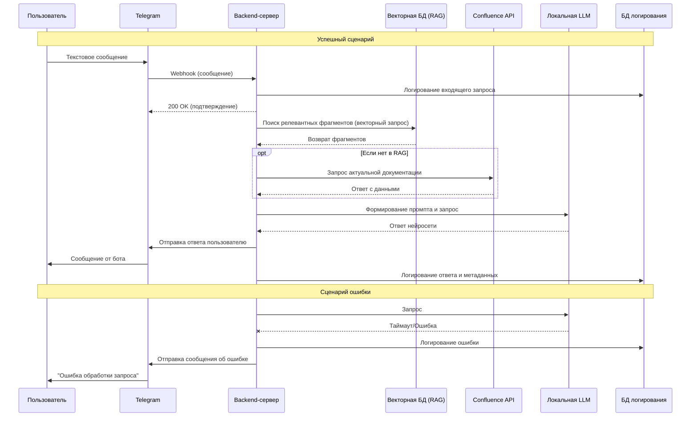

# Документ требований: Telegram-бот на локальной нейросети

## 1. Контекст и цели

**Проблема:** Снижение эффективности работы сотрудников из-за задержки в получении необходимой информации сотрудниками и дополнительные отвлечения руководителей и менеджеров.

**Решение:** Прямой доступ сотрудников к информации через чат-бота в Telegram, использующего локальную нейросеть и актуальные базы знаний.

**Цели:**
- Сократить время получения ответов на запросы сотрудников.
- Устранить отвлекающий фактор руководителей и менеджеров.
- Исключить человеческий фактор и задержки, вызванные промежуточными звеньями.
- Обеспечить ответы в рамках компании на основе актуальной документации.
- Снизить нагрузку на разработчиков по поддержке и обновлению знаний системы.

# Стейкхолдеры проекта

| Стейкхолдер                    | Роль                             | Влияние | Интересы и ожидания                                                            | Риски                                                                            |
| ------------------------------ | -------------------------------- | ------- | ------------------------------------------------------------------------------ | -------------------------------------------------------------------------------- |
| **Сотрудники**                 | Конечные пользователи            | Высокое | Быстрый доступ к точной информации без задержек. Простота использования.       | Недостоверные ответы. Сопротивление новому инструменту.                          |
| **Руководители подразделений** | Косвенные пользователи/заказчики | Высокое | Снижение операционной нагрузки. Сохранение контроля за качеством информации.   | Потеря контроля над информационными потоками. Некачественные ответы сотрудникам. |
| **IT-отдел**                   | Разработка и поддержка           | Высокое | Стабильность системы. Четкие требования. Возможность развития системы.         | Увеличение нагрузки. Сложность интеграции и поддержки LLM.                       |
| **Бизнес-аналитик**            | Проектирование                   | Среднее | Четкие требования. Логичная архитектура. Удовлетворенность стейкхолдеров.      | Неполные требования. Изменения в процессе разработки.                            |
| **Владелец продукта**          | Стратегическое руководство       | Высокое | Сокращение операционных затрат. Увеличение производительности. ROI.            | Недостижение заявленных KPI. Превышение бюджета/сроков.                          |
| **Администратор Confluence**   | Поставщик данных                 | Низкое  | Сохранение актуальности документации. Минимальное влияние на текущие процессы. | Дополнительная нагрузка по поддержанию актуальности данных.                      |
| **Специалист по безопасности** | Контроль                         | Среднее | Соответствие политикам безопасности. Конфиденциальность данных.                | Утечки данных через API. Несанкционированный доступ к нейросети.                 |

## Пояснения к таблице стейкхолдеров

### Ключевые моменты:

1. **Сотрудники** - ключевые бенефициары системы, но их влияние ограничено использованием, а не принятием решений
2. **Руководители** - критически важная группа, чье сопротивление может заблокировать внедрение
3. **IT-отдел** - высокая степень влияния на реализацию и технические ограничения
4. **Владелец продукта** - основной драйвер изменений с максимальной заинтересованностью в результатах
### Уровни влияния:
- **Высокое** - могут существенно повлиять на успех или провал проекта
- **Среднее** - влияют на отдельные аспекты проекта
- **Низкое** - минимальное влияние на outcome проекта
### Управление рисками:
Для каждой группы стейкхолдеров должен быть разработан индивидуальный план коммуникации и вовлечения, учитывающий их интересы и уровень влияния.
## 2. Функциональные требования

### 2.1. Взаимодействие с пользователем (Telegram)

- Бот должен принимать текстовые сообщения от пользователей.
- Бот должен предоставлять ответ в виде текста в том же чате.
- Бот должен иметь команду `/start`, выводящую приветственное сообщение и краткую инструкцию по работе бота.
### 2.2. Взаимодействие с сервером (API)

- Каждое сообщение пользователя должно немедленно отправляться на внутренний сервер через защищенное API.
- API должен возвращать структурированный ответ (JSON), содержащий текстовый ответ нейросети.
- Бот должен корректно обрабатывать ошибки сервера (например, таймаут, недоступность) и уведомлять пользователя об технических неполадках.

### 2.3. Обработка запроса

- Сервер должен принимать запрос от бота, извлекать текст сообщения пользователя.
- Сервер должен использовать локальную LLM для генерации ответа.
- **RAG:** Перед генерацией ответа система должна искать актуальную информацию в:
    - **Векторной базе данных RAG**, наполненной данными из внутренних документов компании.
    - Интеграция актуальной документации с Confluence через API (если есть возможность).
- Сгенерированный ответ должен основываться на найденной актуальной информации, чтобы минимизировать "галлюцинации" и обеспечить точность.
- Ответ должен быть передан обратно боту и показан пользователю в Telegram.
### 2.4. Логирование и анализ

- Все входящие запросы пользователей и исходящие ответы системы должны записываться в базу данных (БД) для логирования.
- **Структура таблицы логов должна включать:**
    - User ID (Telegram)
    - Номер телефона (опционально, если указан)
    - Текст запроса
    - Текст ответа
    - Таймстамп запроса и ответа
    - Статус обработки (успех/ошибка)
    - Источники информации, использованные RAG для формирования ответа (для анализа качества).
- Данные в логах должны быть доступны для последующего анализа и выявления частых запросов, ошибок, неточностей нейросети.

## 3. Нефункциональные требования

- **Доступность:** Система должна быть доступна 24/7. Допустимое время простоя — не более 5% в месяц.
- **Производительность:** 95% запросов должны обрабатываться и возвращать ответ пользователю в течение 30 секунд.
- **Безопасность:** Доступ к API должен быть защищен аутентификацией. Весь трафик должен быть шифрован.
- **Актуальность информации:** Процесс обновления векторной базы RAG данными из Confluence должен быть автоматизирован (например, запускаться ежедневно).

## 4. Глоссарий

- **API (Application Programming Interface)** — набор правил, позволяющий одним программам взаимодействовать с другими. Здесь — для связи бота с сервером.
- **Бот (Чат-бот)** — программа, которая общается с пользователем через интерфейс мессенджера (Telegram).
- **Векторная база данных (RAG)** — специальное хранилище, где данные (например, статьи из Confluence) сохранены в виде числовых векторов. Это позволяет нейросети быстро находить релевантные фрагменты текста для ответа на вопрос.

## Диаграмма последовательности

# Документ: Логика работы Telegram-бота с локальной нейросетью

## 1. Компоненты системы
1.  **Клиент:** Официальное приложение Telegram.
2.  **Бот:** Аккаунт бота в Telegram, работающий на серверах Telegram. Отвечает за прием и отправку сообщений.
3.  **Backend-сервер (Наша система):** Внутренний сервер компании. Выполняет всю бизнес-логику.
4.  **LLM (Ядро):** Локально развернутая большая языковая модель.
5.  **Векторная БД (RAG):** База данных с векторными представлениями документов из Confluence.
6.  **Confluence API:** Источник актуальной документации.
7.  **База данных логирования:** Хранит историю всех взаимодействий.

## 2. Логика работы (Workflow)

**Прямой поток (Успешный сценарий):**

1.  **Событие:** Пользователь отправляет текстовое сообщение боту в Telegram.
2.  **Прием запроса:** Сервера Telegram фиксируют сообщение и немедленно перенаправляют его на `Webhook` нашего backend-сервера.
3.  **Валидация и логирование:**
    *   Backend-сервер проверяет аутентификацию запроса (что он пришел от Telegram).
    *   Сервер записывает в **БД логирования** сырой запрос (`user_id`, `timestamp`, `text`).
    *   Сервер отправляет в Telegram статус "200 OK", чтобы предотвратить повторные отправки сообщения.
4.  **Обработка RAG:**
    *   Текст запроса пользователя преобразуется в вектор (эмбеддинг).
    *   Этот вектор используется для поиска в **Векторной БД** наиболее релевантных фрагментов документации.
    *   При необходимости, осуществляется прямой запрос к **Confluence API** для получения самой свежей информации.
    *   Найденные релевантные фрагменты (контекст) формируются в промпт для нейросети.
5.  **Генерация ответа:**
    *   Промпт, содержащий контекст (данные из RAG) и оригинальный вопрос пользователя, отправляется в **локальную LLM**.
    *   LLM обрабатывает промпт и генерирует текстовый ответ, основанный на предоставленном контексте.
6.  **Отправка ответа:**
    *   Backend-сервер использует API Telegram Bot для отправки сгенерированного ответа в чат пользователя.
7.  **Финальное логирование:**
    *   Сервер записывает в **БД логирования** окончательный ответ, статус "Успех", а также метаданные (например, какие источники из RAG были использованы).

---

**Обработка ошибок (Критичные сценарии):**

| Точка отказа | Реакция системы | Действие для пользователя |
| :--- | :--- | :--- |
| **Backend-сервер недоступен.** | Telegram повторяет попытки доставки сообщения в течение 24 часов. | Сообщение не доставляется. |
| **Таймаут или ошибка LLM / RAG.** | Сервер логирует ошибку, формирует стандартный ответ об технической ошибке. | Бот отправляет сообщение: "В процессе обработки вашего запроса возникла ошибка. Попробуйте позже." |
| **Не найдено информации в RAG.** | Сервер передает LLM запрос без контекста или с пустым контекстом. Логируется факт отсутствия данных. | Бот отправляет ответ LLM с уточнением, что информация не найдена, и предлагает переформулировать вопрос. |

## 3. Ключевые аспекты логики

*   **Асинхронность:** После валидации запроса работа с пользователем считается завершенной. Долгий процесс генерации ответа происходит в фоне. Это предотвращает таймауты со стороны Telegram.
*   **Идемпотентность:** Обработка одного и того же сообщения от Telegram (из-за повторных попыток) не должна приводить к генерации ответа несколько раз. Проверка по `update_id` или собственному ID сообщения.
*   **Контекстуализация:** Ответ всегда должен содержать указание на источник данных (например, "Согласно документации в Confluence..."), чтобы пользователь мог проверить информацию.
*   **Мониторинг:** Логи должны позволять считать ключевые метрики: количество запросов, среднее время ответа, процент ошибок, процент вопросов, на которые не найден ответ в RAG.

## 4. Глоссарий

*   **Webhook** — "обратный вызов". Механизм, при котором Telegram сам отправляет запрос на наш сервер при новом сообщении.
*   **Эмбеддинг** — векторное представление слова или фразы в числовом виде.
*   **Промпт** — текстовый шаблон, инструкция для LLM, содержащая контекст, вопрос и требования к формату ответа.
*   **Идемпотентность** — свойство операции, при котором повторное выполнение дает тот же результат, что и первое.
*   **Таймаут** — превышение времени ожидания ответа от сервиса.
- **Логирование** — процесс записи информации о работе системы (запросы, ответы, ошибки) для последующего анализа.
- **Локальная нейросеть (LLM)** — большая языковая модель, развернутая на собственном сервере компании, а не использующаяся через сторонние сервисы (как ChatGPT). Нужна для конфиденциальности и контроля.
- **RAG (Retrieval-Augmented Generation)** — подход, при котором нейросеть перед генерацией ответа ищет и использует актуальные данные из внешних источников (баз знаний, документов). Это повышает точность и уменьшает количество устаревших или выдуманных ответов.
- **Confluence** — корпоративная система для ведения и хранения документации, баз знаний.
